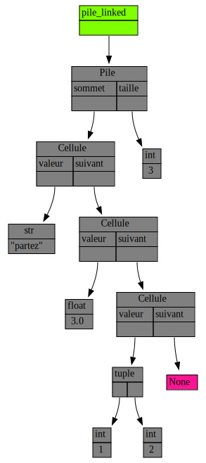

Les objectifs de ce TD sont les suivants :

- introduire le concept d'exception présent dans de nombreux langages impératifs;
- continuer à manipuler des références ;
- maîtriser les piles ;
- maîtriser les files.

## Exercice 1 : exceptions

### Question 1
!!! question " "
    Qu'affiche le programme Java ci-dessous sachant que le point d'entrée d'un programme Java est nécessairement la fonction `public static void main(String[] args)`?

```java

    public static int f(int i) {
        System.out.println("I am f, and I am going to divide " +
                           String.valueOf(i) +
                           " by (i - 42) and return the result");
        int i_minus_42 = i - 42;
        return i / i_minus_42;
    }

    public static void g(int i) {
        System.out.println("I am g, and because I am lazy, I am just going " +
                           "to callf(i) and print what it returned to me");
        int res_f = f(i);
        System.out.println("f(" + i + ") = " + res_f);
    }

    public static void main(String[] args) {
        g(84);
        g(42);
    }
```

###  Correction question 1
<details markdown="1">
<summary>Cliquez ici pour révéler la correction.</summary>

```console
I am g, and because I am lazy, I am just going to callf(i) and print what it returned to me
I am f, and I am going to divide 84 by (i - 42) and return the result
f(84) = 2
I am g, and because I am lazy, I am just going to callf(i) and print what it returned to me
I am f, and I am going to divide 42 by (i - 42) and return the result
Exception in thread "main" java.lang.ArithmeticException: / by zero
	at TestException.f(TestException.java:10)
	at TestException.g(TestException.java:16)
	at TestException.main(TestException.java:22)
```

On profite de cet exemple pour se rappeler qu'on fait du BPI, et qu'une grande partie de ce qu'on apprend dans le contexte Python est valide dans d'autres langages impératifs.

Avec cette première question, on voit qu'une exception "casse" le flot de contrôle puis remonte dans la pile d'exécution (blocs et fonctions) jusqu'en haut si elle n'est pas attrapée.

On voit également avec cet exemple que si on sait lire un message d'erreur de l'interpréteur Python on sait aussi lire ceux de la machine virtuelle Java dans lesquels la pile d'exécution est affichée dans l'autre sens.

Correction vidéo :

<iframe src="https://videos.univ-grenoble-alpes.fr/video/13663-ensimag-bpi-td11-correction-exercice-1-question-1/?is_iframe=true" width="640" height="360" style="padding: 0; margin: 0; border:0" allowfullscreen ></iframe>
</details>

### Question 2
!!! question " "
    Qu'affiche le programme ci-dessous ?

```python
#!/usr/bin/env python3

def f(i):
    print("I am f, and I am going to divide "
          + str(i)
          + " by (i - 42) and return the result")
    i_minus_42 = i - 42
    if i_minus_42 == 0:
        raise ArithmeticError("Une division par 0, mais "
                              "pour qui vous prenez vous ?")
    return i / i_minus_42

def g(i):
    print("I am g, and because I am lazy, "
          "I am just going to callf(i) and print what it returned to me")
    try:
        res_f = f(i)
        print("f(" + str(i) + ") = " + str(res_f));
    except ArithmeticError:
        print("Oulala, f a fait des bétises")

def main():
    g(84);
    g(42);

if __name__ == "__main__":
    main()
```

###  Correction question 2
<details markdown="1">
<summary>Cliquez ici pour révéler la correction.</summary>

On revient à Python, parce que c'est ce qu'on écrit en BPI donc il faut connaître la syntaxe.

Cette deuxième question à également pour objectif de montrer comment le programmeur peut lever lui même sa propre exception et comment attraper une exception pour arrêter la remontée dans la pile d'exécution.

Le programme affiche :

```console
I am g, and because I am lazy,I am just going to callf(i) and print what it returned to me
I am f, and I am going to divide 84 by (i - 42) and return the result
f(84) = 2.0
I am g, and because I am lazy,I am just going to callf(i) and print what it returned to me
I am f, and I am going to divide 42 by (i - 42) and return the result
Oulala, f a fait des bétises
```

Correction vidéo de l'exercice :

<iframe src="https://videos.univ-grenoble-alpes.fr/video/13664-ensimag-bpi-td11-correction-exercice-1-question-2/?is_iframe=true" width="640" height="360" style="padding: 0; margin: 0; border:0" allowfullscreen ></iframe>

Et voici une autre vidéo, introduisant le concept d'exception sur un exemple :

<iframe src="https://videos.univ-grenoble-alpes.fr/video/14443-ensimag-bpi-exceptions/?is_iframe=true" width="640" height="360" style="padding: 0; margin: 0; border:0" allowfullscreen ></iframe>

Vous trouverez la hiérarchie des exceptions Python dans la [documentation officielle ici](https://docs.python.org/3.8/library/exceptions.html#exception-hierarchy)
</details>


## Exercice 2 : les derniers seront les premiers


Vous êtes contactés par l'association *NiEmacsNiVim* pour réaliser un petit projet logiciel pour eux.
Cette association développe un éditeur de texte révolutionnaire dans lequel il **suffit** de taper `contrôle + s` pour sauvegarder un fichier et de taper `contrôle + z` pour annuler la dernière action.
Afin justement de pouvoir annuler un grand nombre d'actions, *NiEmacsNiVim* nous demande de leur fournir un module Python permettant de :

- créer un historique d'actions initialement vide ;
- ajouter une action à un historique ;
- récupérer la dernière action ajoutée en levant une exception si il n'y a plus d'action dans l'historique ;
- connaître la taille de l'historique.

### Question 1
!!! question " "
    Ce cahier des charges correspond il à une structure de données (SDD) ou à un type abstrait (TA) ?


###  Correction question 1
<details markdown="1">
<summary>Cliquez ici pour révéler la correction.</summary>
C'est un TA car seule une spécification est donnée.
</details>

### Question 2
!!! question " "
    Avez vous déjà rencontré quelque chose de similaire, et si oui sous quelle dénomination ?

###  Correction question 2
<details markdown="1">
<summary>Cliquez ici pour révéler la correction.</summary>
C'est une pile, une stack en anglais, et c'est du Last In First Out (LIFO).
</details>

### Question 3
!!! question " "
    Proposez un squelette de votre module pour qu'il puisse être validé par *NiEmacsNiVim* avant que vous ne commenciez le développement.
    Vous fournirez une nouvelle classe permettant de représenter une pile.
    Pour rappel, dans le cadre de BPI nous utilisons les classes uniquement comme un agrégat de données.
    Les opérations que vous fournirez seront donc des fonctions et non pas des méthodes.

###  Correction question 3
<details markdown="1">
<summary>Cliquez ici pour révéler la correction.</summary>
Voici le squelette de code que nous proposons :

```python
class Pile:
    """Classe représentant une pile."""

    # TODO
    ...


def empile(pile, element):
    """On empile l'élément donné dans la pile donnée"""
    # TODO
    ...


def depile(pile):
    """On depile l'élément au sommet de la pile donnée"""
    # TODO
    ...
```
</details>

### Question 4
!!! question " "
    Implémentez votre module sans utiliser de `list` Python.

###  Correction question 4
<details markdown="1">
<summary>Cliquez ici pour révéler la correction.</summary>
Voici l'implémentation basée sur une liste chaînée :

```python
class Cellule:
    """Une cellule d'une pile.

    Possède une référence vers la valeur et
    une référence vers la cellule suivante.
    """

    def __init__(self, valeur, suivant):
        self.valeur = valeur
        self.suivant = suivant


class Pile:
    """Classe représentant une pile."""

    def __init__(self):
        """On utilise un chaînage pour représenter la pile."""
        self.sommet = None
        self.taille = 0


def empile(pile, element):
    """On empile l'élément donné dans la pile donnée"""
    pile.sommet = Cellule(element, pile.sommet)
    pile.taille += 1


def depile(pile):
    """On depile l'élément au sommet de la pile donnée"""
    # Que faire si la pile est vide ?
    # On lève une exception comme l'indique le cahier des charges.
    # On utilise IndexError car c'est l'exception
    # levée en général en Python dans ce genre de situation.
    if pile.taille == 0:
        raise IndexError("Can't pop from empty stack")
    pile.taille -= 1
    sommet = pile.sommet
    pile.sommet = pile.sommet.suivant
    return sommet
```
</details>

### Question 5
!!! question " "
    Dessinez la mémoire d'une pile contenant du haut vers le bas `"partez"`, `3.0`, `(1, 2)`.
    C'est à dire une pile dans laquelle nous avons empilé `(1, 2)` puis `3.0` puis `"partez"`.

###  Correction question 5
<details markdown="1">
<summary>Cliquez ici pour révéler la correction.</summary>
Voici le dessin des instances en mémoire :



</details>

### Question 6
!!! question " "
    Justifiez vos choix auprès de *NiEmacsNiVim*.

###  Correction question 6
<details markdown="1">
<summary>Cliquez ici pour révéler la correction.</summary>
Bonjour *NiEmacsNiVim*,

Concernant le nom des fonctions, nous avons utilisé une terminologie communément admise.
En effet, les deux opérations d'une pile sont en général appelées `empile` et `depile` en français (`push` et `pop` en anglais).

Concernant les performances, pour avoir une implémentation efficace, c'est-à-dire avec des coûts constants, on peut :

- utiliser une liste simplement chaînée avec un pointeur vers la tête et `empile(v)` == `ajoute_en_tete(v)` et `depile()` == `supprime_en_tete()`; c'est ce que nous avons fait dans le code que nous vous fournissons ;
- utiliser une liste doublement chaînée avec un pointeur vers la fin et `empile(v)` == `ajoute_en_fin(v)` et `depile()` == `supprime_en_fin()` ; mais c'était plus compliqué que la liste simplement chaînée.
</details>

### Question 7
!!! question " "
    Sans écrire de code, comment feriez-vous pour implémenter votre module avec une `list` Python ?
    Quels seraient les avantages et les inconvénients par rapport à votre implémentation précédente ?

###  Correction question 7
<details markdown="1">
<summary>Cliquez ici pour révéler la correction.</summary>
Pour avoir des coûts constant avec un tableau dynamique, donc une `list` en Python, il faut empiler et dépiler **à la fin** du tableau dynamique.
Donc il faut :

- `empile(v)` == `append(v)` ;
- `depile()` == `pop()`.

Voici ce que ça donne si on implémente notre `Pile` avec ça :

```python
class PileTableauDynamique:
    """Classe représentant une pile avec un tableau dynamique.

    La classe se nomme volontairement pas "Historique"
    car c'est une pile générique qui peut stocker
    n'importe quel type de données.
    """

    def __init__(self):
        """Construit une pile vide.

        Ici nous avons choisi d'utiliser en interne une list
        Python pour avoir le moins de choses à implémenter.
        """
        self.data = []
        self.taille = 0


def empile_tableau_dynamique(pile, element):
    """On empile l'élément donné dans la pile donnée"""
    pile.data.append(element)
    pile.taille += 1


def depile_tableau_dynamique(pile):
    """On depile l'élément au sommet de la pile donnée"""

    # Que faire si la pile est vide ?
    # On lève une exception comme l'indique le cahier des charges.
    # On utilise IndexError car c'est l'exception
    # levée par list.pop() si la liste est vide.
    #
    # Nous pourrions simplement laisser l'exception de
    # la liste remonter, mais ici ça nous permet de
    # définir notre propre message d'erreur.
    #
    if pile.taille == 0:
        raise IndexError("Can't pop from empty stack")
    pile.taille -= 1
    return pile.data.pop()
```

En pratique, dans du code Python professionnel on utiliserait cette solution avec une `list` car :

- c'est beaucoup plus facile et rapide à écrire ;
- performant car la liste est implémentée directement en C et non en Python ;
- et il n'y a aucun désavantage.

Voici le dessin des instances en mémoire d'une pile avec `list` contenant les mêmes éléments que dans la question 5 :


Correction vidéo pour l'ensemble de l'exercice :

<iframe src="https://videos.univ-grenoble-alpes.fr/video/13667-ensimag-bpi-td11-correction-exercice-2/?is_iframe=true" width="640" height="360" style="padding: 0; margin: 0; border:0" allowfullscreen ></iframe>

</details>


## Exercice 3 : première arrivée, première servie

### Question 1
!!! question " "
    Analysez le module Python ci-dessous et notez toutes les remarques (positives et négatives) et questions que vous pouvez avoir.

```python
#!/usr/bin/env python3

"""Implémentation de l'ADT file en python."""

import datetime
import time

def arrive(l, b):
    l.append(b)

def premier(l):
    assert l, "file vide!"
    preums = l[0]
    l.pop(0)
    return preums

# Quelques tests
file_devant_la_poste = []
if datetime.date.today().weekday() == 5: # Samedi, c'est blindé !
    for i in range(1, 43):
        arrive(file_devant_la_poste, "client" + str(i))
else:
    arrive(file_devant_la_poste, "Micheline")
    arrive(file_devant_la_poste, "Karim")
    arrive(file_devant_la_poste, "Bao")
print(file_devant_la_poste)
try:
    while True:
        print(premier(file_devant_la_poste) + " au guichet SVP")
        time.sleep(5)
except:
    pass
print(file_devant_la_poste)
```

###  Correction question 1
<details markdown="1">
<summary>Cliquez ici pour révéler la correction.</summary>
Il y a beaucoup de choses intéressantes à dire sur ce petit programme.
Les voici de la plus importante à la moins importante dans le contexte de ce TD :

- bien qu'aucune classe ne soit définie, nous travaillons bien ici avec le TA **file** implémentée à l'aide d'un tableau dynamique, donc une `list` en Python ;
- faire `pop(0)` sur une `list` Python, donc un tableau dynamique, ça coûte cher comme il faut bouger tout le monde vers la gauche ;
- comment faire pour avoir un coût constant : avec une liste simplement chaînée avec pointeur de tête et pointeur de fin et `enqueue(v) = ajoute_en_fin(v)` et `dequeue() = supprime_en_tete()` ;
- une assertion est techniquement une exception en Python, de type `AssertionError`. On peut donc l'attraper comme n'importe quelle exception ;
- néanmoins, ici il ne faut pas utiliser une assertion mais une exception, sûrement `IndexError`, voir le point suivant pour comprendre pourquoi ;
- différence donc entre assertion et exception : une assertion est utilisée pour informer que quelque chose de **logiquement** impossible ne dépendant pas des entrées du programme a eu lieu. Autrement dit, si une assertion nous saute à la figure, c'est parce que nous, programmeur avons loupé quelque chose. Au contraire, une exception est levée dans le cas d'une erreur pendant l'exécution qui était **anticipable** (par exemple `FileNotFoundError` pour la fonction `open()`). Citation "Python’s assert statement is a debugging aid, not a mechanism for handling run-time errors. The goal of using assertions is to let developers find the likely root cause of a bug more quickly. An assertion error should never be raised unless there’s a bug in your program." Les assertions peuvent être ignorées par l'interpréteur avec `-O`. Comme ici on fournit un module, et que nous souhaitons gérer une erreur pendant l'exécution anticipable et non un bug de nous programmeur, il ne faut pas utiliser d'assertion mais `IndexError` ;
- il manque le teste `if __name__ == "__main__"` qui est crucial ici car nous sommes dans le cadre d'un module ;
- le choix des noms des deux fonctions est tout pourri. En français le "bon" choix semble être `defiler` et `enfiler` ;
- le module standard `datetime` permet de savoir quel jour et quelle heure il est ;
- le module standard `time` permet de dormir un peu.

Enfin, n'hésitez pas aller (re)voir le mémo concernant les TA et SDD [disponible ici](../../../2-iterations/adt_sdd.pdf) pour replacer les files, les piles et leur implémentation au bon endroit dans le contexte des TA et SDD que nous avons déjà vus.

Correction vidéo :

<iframe src="https://videos.univ-grenoble-alpes.fr/video/13675-ensimag-bpi-td11-correction-exercice-3/?is_iframe=true" width="640" height="360" style="padding: 0; margin: 0; border:0" allowfullscreen ></iframe>
</details>


## Exercice 4 : il y a des piles et des files partout (pour aller plus loin)


### Question 1
!!! question " "
    Listez toutes les utilisations de le TA pile au sein d'un ordinateur que vous avez déjà rencontrées.

###  Correction question 1
<details markdown="1">
<summary>Cliquez ici pour révéler la correction.</summary>
Plusieurs idées :

- la pile des frames Python quand on appelle des fonctions ;
- cette pile d'appels de fonction est également présente dans tous les autres langages ;
- la pile matériel du processeur qui fournit une instruction `push` et une instruction `pop` pour justement faciliter la réalisation de la pile d'appels des langages ;
- pour vérifier qu'un parenthésage est correct : `([]{{}}[])` est ok mais pas `([)(])`. On empile dès qu'on a une parenthèse ouvrante, et on dépile et on vérifie que ça correspond dès qu'on a une parenthèse fermante.
</details>

### Question 2
!!! question " "
    Même question pour le TA file.

###  Correction question 2
<details markdown="1">
<summary>Cliquez ici pour révéler la correction.</summary>
Plusieurs idées :

- la file des jobs en attente dans l'imprimante du premier étage du bâtiment E ;
- la file des paquets à envoyer/recevoir sur le réseau ;
- la file des requêtes vers le disque dur.
</details>

### Question 3
!!! question " "
    Faites un dessin/schéma pour illustrer le plus simplement et clairement possible selon vous les notions de pile et de file.
    L'objectif est d'expliquer ces concepts à vos collègues absents aujourd'hui.

###  Correction question 3
<details markdown="1">
<summary>Cliquez ici pour révéler la correction.</summary>


</details>

