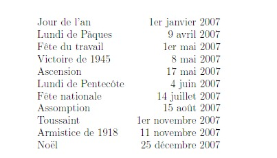

# Exercice :

## I . Version Programmation Impératif :

- Le gouvernement désire ajouter un jour férié mais il voudrait le faire à une date éloignée des jours
fériés existant. 

- On suppose également que ce jour ne sera pas inséré entre Noël et le jour de l’an.

- On va donc calculer le nombre de jours qui sépare deux jours fériés dont voici la liste pour l’année
2007 :



On rappelle que l’année 2007 n’est pas une année bissextile et qu’en conséquence, le mois de février
ne comporte que 28 jours.

- **``TODO 1:``** 

    - Afin de simplifier la tâche, on cherche à attribuer un numéro de jour à chaque jour férié : l’année a 365 jours, pour le numéro du lundi de Pâques, soit 31 (mois de janvier) + 28 (février) + 31 (mars) + 9 = 89. 

    - La première question consiste à construire une fonction qui calcule le numéro d’une date étant donné un jour et un mois ,Cette fonction prend comme entrée :
        - un numéro de jour
        - un numéro de mois
        - une liste de 12 nombres correspondant au nombre de jours dans chacun des douze mois de l’année

- **``TODO 2:``** 

    - Si on définit la liste des jours fériés comme étant une liste de couples (jour, mois) triée par ordre chronologique, il est facile de convertir cette liste en une liste de nombres correspondant à leur numéro dans l’année. 
    
    - La fonction à écrire ici appelle la précédente et prend une liste de couples en entrée et retourne comme résultat une liste d’entiers. 

- **``TODO 3:``** 

    - A partir de cette liste d’entiers, il est facile de calculer l’écart ou le nombre de jours qui séparent deux jours fériés. 
    
    - Il ne reste plus qu’à écrire une fonction qui retourne l’écart maximal entre deux jours fériés, ceux-ci étant définis par la liste de numéros définie par la question précédente. 
    
    - Un affichage du résultat permet de déterminer les deux jours fériés les plus éloignés l’un de l’autre. Quels sont-ils ? 


## II . Version POO :

Le programme précédent n’utilise pas de classe. L’objectif de ce second exercice est de le réécrire avec une classe . 

- **``TODO 4:``**

    - Une fonction du programme précédent effectue la conversion entre un couple jour-mois et un numéro de jour. Les calculs sont faits avec le numéro mais le résultat désiré est une date : les numéros ne sont que des intermédiaires de calculs qui ne devraient pas apparaître aussi explicitement.
    
    - La première question consiste à créer une classe Date :

    ```python
    class Date :
        def __init__ (self, jour, mois) :
            # TODO ...
    ```

    - A cette classe, on ajoute une méthode qui retourne la conversion du couple jour-mois en un numéro de jour de l’année

    - On ajoute maintenant une méthode calculant le nombre de jours séparant deux dates (ou objet de type Date et non pas numéros). Cette méthode pourra par exemple s’appeler **``difference``**.

    -  Il ne reste plus qu’à compléter le programme pour obtenir les mêmes résultats que le programme de l’exercice 1.


- **``TODO 5:``**

    - Avec ce programme, lors du calcul des écarts entre tous les jours fériés consécutifs, combien de fois effectuez-vous la conversion du couple jour-mois en numéro pour le second jour férié de l’année ?

    - Est-ce le même nombre que pour le programme précédent (en toute logique, la réponse pour le premier programme est 1) ? 

    - La réponse à la question précédente vous suggère-t-elle une modification de ce second programme ?
